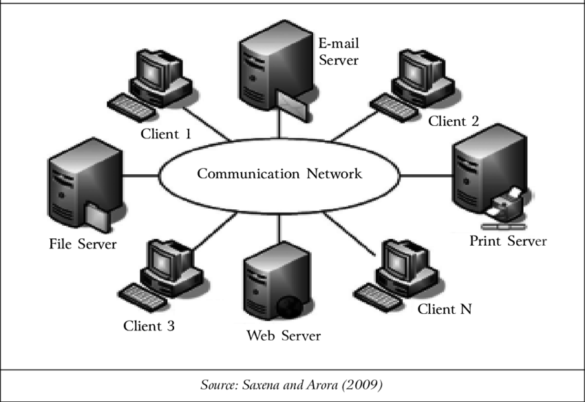
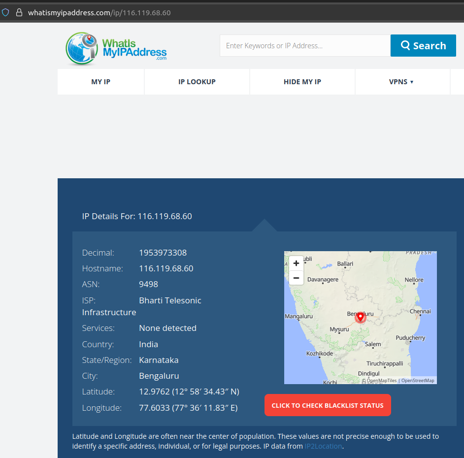
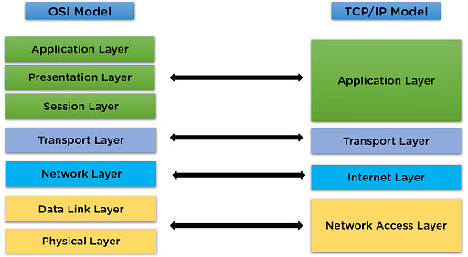

# Computer Networking
A computer network is a system of interconnected computing devices (computer, printer, servers, routers etc) that can access data and share resources via communication medium and protocols.

# Tracing back Netflix.com

# OSI (Open Systems Interconnection) Model
- Open System Interconnection model is a conceptual framework that standardlize how different computer system communicate with each other over a network.
- It is comprise of 7 layers:

| Layer | Name             | Function                                              | Examples                       |
| ----- | ---------------- | ----------------------------------------------------- | ------------------------------ |
| 7     | **Application**  | End-user interface; provides services to applications | HTTP, FTP, DNS, SMTP, POP3     |
| 6     | **Presentation** | Translates data formats; encryption, compression      | SSL, JPEG, ASCII, MPEG         |
| 5     | **Session**      | Manages sessions/connections between apps             | NetBIOS, RPC, SQL session      |
| 4     | **Transport**    | Ensures reliable delivery (or not); flow control      | TCP, UDP                       |
| 3     | **Network**      | Routing and addressing across networks                | IP, ICMP, IPSec, IGMP          |
| 2     | **Data Link**    | Frame transfer between devices; error detection       | Ethernet, MAC, PPP, Switches   |
| 1     | **Physical**     | Physical medium, cables, signals                      | Cables, Hubs, Wi-Fi, Bluetooth |

- Memonic to remember the layers:
`A`ll `P`eople `S`eem `T`o `N`eed `D`ata `P`rocessing

- 📦 Real-World Example: Sending an Email
    - **Application** (7): You write the email (SMTP)
    - **Presentation** (6): It’s encoded in ASCII
    - **Session** (5): A session is created between your mail client and server
    - **Transport** (4): TCP breaks it into segments, ensures delivery
    - **Network** (3): IP adds sender and receiver IPs for routing
    - **Data Link** (2): Ethernet adds MAC addresses, error checking
    - **Physical** (1): Bits are sent over Wi-Fi or Ethernet cable

- Layers 1–4 (Lower layers): Focus on data transmission.
- Layers 5–7 (Upper layers): Focus on application-specific processing.

## TCP/IP Layer
- TCP/IP (Transmission Control Protocol/ Internet Protocol) is a simplified and a practical version of the OSI model.
- It has 4 layers and maps OSI model like this:

| TCP/IP Layer          | Corresponding OSI Layers | Description                                       | Examples                       |
| --------------------- | ------------------------ | ------------------------------------------------- | ------------------------------ |
| **4. Application**    | OSI Layers 5, 6, 7       | User-facing software, data formatting, sessions   | HTTP, HTTPS, FTP, SMTP, DNS    |
| **3. Transport**      | OSI Layer 4              | Ensures data delivery between systems             | TCP, UDP                       |
| **2. Internet**       | OSI Layer 3              | Handles addressing and routing across networks    | IP, ICMP, ARP, IGMP            |
| **1. Network Access** | OSI Layers 1 & 2         | Manages physical data transfer and link protocols | Ethernet, Wi-Fi, MAC, PPP, DSL |

- Memonic to remember the layers:
`A`ll `T`ransmission `I`nternet `N`eeds

# IP Address
- Internet Protocol (IP) Address is a unique identifier given to each devices on a network that uses the internet protocol for the communication.
- Types of IP address:
    - IPv4:
        - format: 192.168.0.1 (4 numbers separated by dots each from 0-255 `8 bits`)
        - 32 bit address: → allows ~4.3 billion addresse
        - 
    - IPV6:
        - format: 2001:0db8:85a3:0000:0000:8a2e:0370:7334
        - 128 bit address → allows 340 undecillion addresses
        - Needed because IPv4 addresses are running out

# IP Address Class

# SubNets

# SubNet Mask

# CIDR 

# NAT

# Network ID

# Broadcast ID
